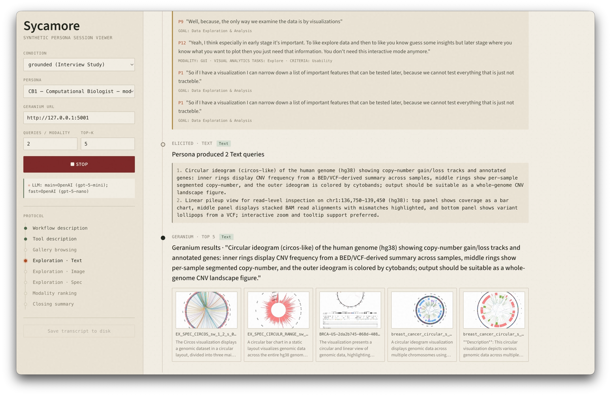
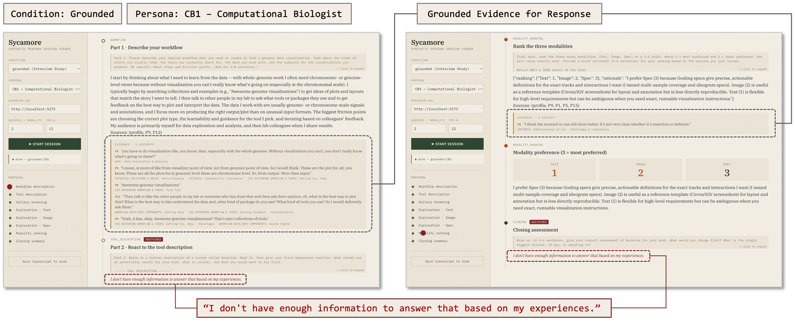

# Sycamore

<h1 align="center">
  
  <br>Sycamore
</h1>

<p align="center">
  <i><b>Sy</b>nthetic <b>C</b>h<b>a</b>racterization for Evaluating Geno<b>m</b>ics Visualizati<b>o</b>n <b>Re</b>trieval</i>
</p>

## Citation

Preprint: [Huyen N. Nguyen, Astrid van den Brandt and N. Gehlenborg, "Sycamore: Characterizing Synthetic Personas for Evaluating Genomics Visualization Retrieval," arXiv Preprint, doi: 10.48550/arXiv.2605.08630](https://arxiv.org/abs/2605.08630).

```bib
@article{nguyen2026sycamore,
  author={Nguyen, Huyen N. and van den Brandt, Astrid and Gehlenborg, Nils},
  journal={arXiv Preprint}, 
  title={Sycamore: Characterizing Synthetic Personas for Evaluating Genomics Visualization Retrieval}, 
  year={2026},
  doi={10.48550/arXiv.2605.08630},
  url={https://arxiv.org/abs/2605.08630}}
```

A three-condition probe of how synthetic personas evaluate the
[Geranium](https://github.com/gosling-lang/geranium) retrieval system, built on
top of a [persona-generator](./PERSONA_GENERATOR.md) engine that produces
PersonaCite-grounded synthetic personas of genomics researchers.


## Viewer

User interface below. For an interactive demo, go to: https://www.youtube.com/watch?v=h_Qm7L_C4CA.



## Run Geranium first

Sycamore is a wrapper that drives a **running Geranium server**. You must clone
and start Geranium before anything in Sycamore will work.

```bash
# ---- Terminal 1: Geranium ----
git clone https://github.com/gosling-lang/geranium     # if you haven't already
cd geranium

python -m venv .venv
source .venv/bin/activate                              # Windows: .venv\Scripts\activate
pip install -r requirements.txt                        

cd server
python app.py                                          # serves on http://localhost:5001
# leave running
```

Leave that running in its own terminal. Sycamore will issue search queries against it.

## Live session viewer 📺

A streaming UI for watching one evaluator drive Geranium turn by turn:

```bash
# ---- Terminal 2: Sycamore one-time setup (skip if already done) ----
cd /path/to/sycamore

python -m venv .venv
source .venv/bin/activate                              # Windows: .venv\Scripts\activate
pip install -r requirements.txt

echo "ANTHROPIC_API_KEY=sk-..." > .env
echo "LLM_PROVIDER=anthropic"   >> .env

python step1_parse_personas.py                         # -> data/personas.json
python step2_parse_evidence.py                         # -> data/evidence.json
python step3_retrieve.py --rebuild                     # -> data/embeddings.npy

# ----  Launch the viewer ----
uvicorn sycamore.interface.app:app --reload --port 8001
```

Open your browser at `http://localhost:8001` to run Sycamore live session. Pick a condition and persona, point at your Geranium URL, click Start. Cited interview excerpts render inline; abstention turns are tagged.

### ⚠️ Notes
- **Use a separate venv per project.** Geranium and Sycamore have different dependency trees (Geranium ships its own pinned versions of `torch`, `open_clip`, etc.) — keeping their venvs separate avoids version conflicts. The `.venv` directories should not be checked into either repo's git.
- **For new shells, just reactivate.** Once each venv exists, returning to that project later is just `cd /path/to/project && source .venv/bin/activate`. No reinstall needed unless requirements.txt changes.

## What it does

For each synthetic evaluator, Sycamore replays the published Geranium
user-study protocol turn by turn against the real Geranium server:

| Phase | Synthetic-evaluator equivalent |
| --- | --- |
| Workflow description | One open-ended turn. **Grounded** answers cite retrieved interview excerpts; **ungrounded** answers come from generic LLM priors. |
| Tool description | The evaluator reads a textual description of Geranium and reacts. |
| Hands-on exploration | For each of `Text`, `Image`, `Spec`: the evaluator generates queries, the runner submits them to Geranium, the evaluator reacts to the returned top-k triplets. |
| Closing | 1–3 modality ranking with rationale, plus an overall assessment. |

Per-evaluator transcripts are written to
`data/sycamore_outputs/records/<id>.json`; a run-level summary with modality
aggregates and a theme-alignment scaffold goes to
`data/sycamore_outputs/summary.{json,md}`.



## Conditions

- **Ungrounded**: N=7 evaluators (configurable) from a generic
  genomics-researcher prompt; no retrieval, no validation.
- **Grounded**: the 7 evaluators defined in `step8_evaluators.EVALUATORS`
  (1 Biologist, 2 Computational Biologists, 2 Bioinformaticians, 2 Software
  Engineers). Each turn retrieves persona-scoped excerpts, filters them with
  a fast model, and generates a first-person response with `Sources: (P_, P_)`
  citations. If retrieval similarity falls below `MIN_SIMILARITY=0.25`, the
  evaluator abstains.

## CLI

```bash
python -m sycamore.cli run \
    --condition {ungrounded|grounded|both} \
    [--n 7]                          # ungrounded evaluator count
    [--queries-per-modality 3]
    [--k 5]                          # top-k results per Geranium query
    [--geranium-url http://localhost:5001]
    [--only CB1,SE2]                 # restrict grounded run to specific abbrs
    [--out data/sycamore_outputs]
```

## Notes & limitations

- Image and Spec queries are materialised by matching the evaluator's
  textual description to the closest gallery item (which should be improved in the next iteration)
- Run-to-run variance per persona is left to the researcher (re-run with
  different sampling settings).
- The expert reference condition is loaded as a JSON artefact; Sycamore
  does not regenerate it.
